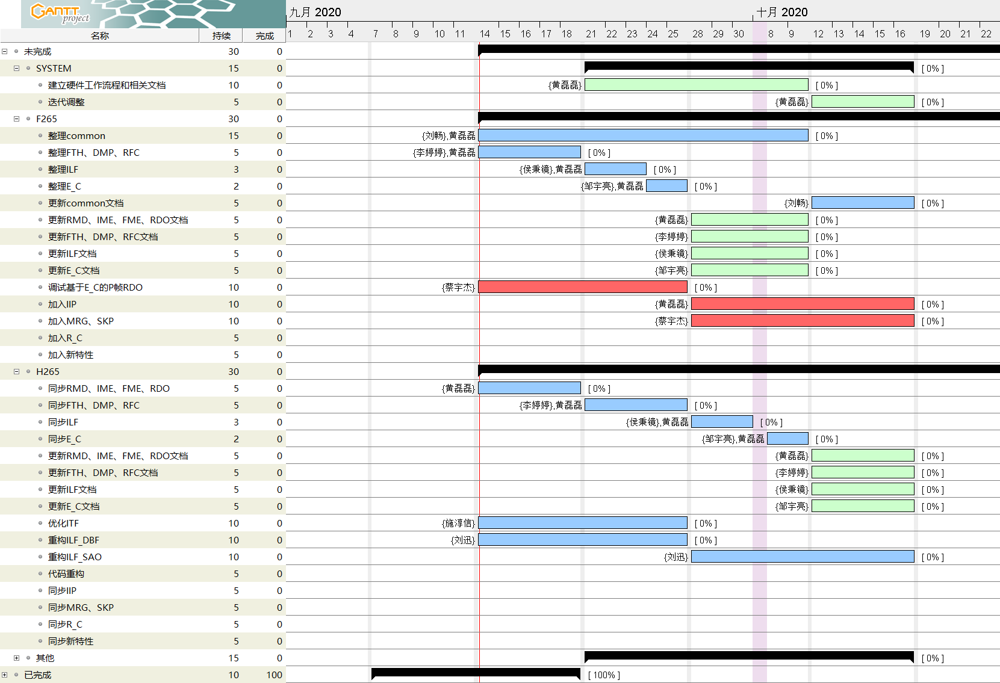

.. -----------------------------------------------------------------------------
    ..
    ..  Filename       : main.rst
    ..  Author         : Huang Leilei
    ..  Created        : 2020-07-12
    ..  Description    : introduction related documents
    ..
.. -----------------------------------------------------------------------------

Introduction
============

(20201117) Project Tree
-----------------------

::

    /
    ├── build                       build environments
    │   ├── linux                       linux one
    │   └── windows                     windows one
    ├── doc                         documents
    │   ├── doxygen                     documents generated by doxygen
    │   ├── description                 documents written manually
    │   └── performance                 b-d rate performance
    ├── script                      script
    │   ├── run                         autorun environment for f265
    │   │   ├── makefile                    makefile
    │   │   ├── f265.sh                     f265 execuation script
    │   │   ├── f265.cfg                    f265 configuration file
    │   │   └── f265.xls                    b-d rate calculation excel
    │   ├── run*                        autorun environment for *
    │   ├── getInfo                     script to get bit rate and PSNR information
    │   ├── getBdRate                   script to calculate bd rate
    │   ├── getPsnr                     script to calculate PSNR
    │   ├── showDiff                    script to show difference between two yuv files
    │   ├── fitCst                      script to fit relationship between cost and coefficients
    │   └── runListUpdate.sh            "update" script
    └── src                         source codes
        ├── sys                         system level codes
        │   ├── cfg                         configuration related codes
        │   └── fbs                         bit steam related codes
        ├── common                      common codes
        │   ├── lcu                         base class LCU related codes
        │   └── rfc                         reference frame configuration related codes
        ├── enc                         encoder related codes
        │   ├── enc_knl                     encoder kernel related codes
        │   │   ├── enc_fth                     fetch related codes
        │   │   ├── enc_rmd                     rough mode decision related codes
        │   │   ├── enc_ime                     integer motion estimation related codes
        │   │   ├── enc_fme                     fractional motion estimation related codes
        │   │   ├── enc_rdo                     rate-distorion optimizatioon related codes
        │   │   ├── enc_ilf                     in-loop filter related codes
        │   │   ├── enc_e_c                     entropy encoding related codes
        │   │   ├── enc_dmp                     dump related codes
        │   │   └── enc_knl.cpp                 top of encoder kernel
        │   ├── enc_top.cpp                 top of encoder
        │   └── CMakeLists.txt              cmake list
        └── dec                         decoder related codes
            └── dec_knl                     decoder kernel related codes
                └── dec_e_d                     entropy decoding related codes

(20200917) Macro-Definition List
--------------------------------

.. table::
    :align: left
    :widths: auto

    ======== =================== ===================================================
     Domain   Name                Description
    ======== =================== ===================================================
     TOP      NUMB_CHN            number of channels (1: y; 3: y u v)
     TOP      NUMB_MOD            number of intra modes (35)
     TOP      SIZE_FRA_MAX_X      maximum size of frame width (4096 now)
     TOP      SIZE_FRA_MAX_Y      maximum size of frame height (4096 now)
     TOP      SIZE_LCU            size of LCU (32 now)
     TOP      SIZE_T_U_MAX        maximum size of TU (32)
     TOP      SIZE_C_U_MIN        minimum size of CU (8)
     TOP      SIZE_REC_EXT        size of extended reconstruction data (derived)
     TOP      SIZE_FMV_EXT_X      horizontal size of extended fmv data (derived)
     TOP      SIZE_FMV_EXT_Y      vertical size extended fmv data (derived)
     TOP      SIZE_REF_EXT_MAX    maximum size of extended reference data (derived)
     TOP      DATA_SCL_CH         scaler of chroma channel (1: 4:4:4; 2: 4:2:0)
     TOP      LOG2_SIZE_LCU       log2 of SIZE_LCU (derived)
     TOP      LOG2_SIZE_C_U_MIN   log2 of SIZE_C_U_MIN (derived)
     TOP      LOG2(x)             log2 of x (derived)
     ...      ...                 ...
    ======== =================== ===================================================

(20200917) Parameter List
-------------------------

.. table::
    :align: left
    :widths: auto

    .. include:: cfg.rst

(20201117) Owner
----------------

.. table::
    :align: left
    :widths: auto

    ================================== ===========================
     Directory                          Owner
    ================================== ===========================
     /build/linux/*                     Huang Leilei
     /build/windows/*                   Huang Leilei
     /doc/*                             ...
     /script/*                          Huang Leilei
     /src/common/common*                Huang Leilei, Liu Chang
     /src/common/lcu/*                  Huang Leilei, Liu Chang
     /src/common/rfc/*                  Li Tingting
     /src/sys/cfg/*                     Huang Leilei
     /src/sys/fbs/*                     Zou Yuliang
     /src/sys/defines_enc.hpp           Huang Leilei
     /src/sys/types_enc.hpp             Huang Leilei
     /src/enc/enc_top.cpp               Huang Leilei
     /src/enc/enc_knl/enc_fth/*         Huang Leilei
     /src/enc/enc_knl/enc_rmd/*         Huang Leilei
     /src/enc/enc_knl/enc_ime/*         Huang Leilei, Shi Chunxin
     /src/enc/enc_knl/enc_fme/*         Huang Leilei, Shi Chunxin
     /src/enc/enc_knl/enc_rdo/*         Huang Leilei, Liu Xun
     /src/enc/enc_knl/enc_rec/*         Huang Leilei, Liu Chang
     /src/enc/enc_knl/enc_ilf/*         Hou Bingjing, Liu Xun
     /src/enc/enc_knl/enc_e_c/*         Cai Yujie, Zou Yuliang
     /src/enc/enc_knl/enc_dmp/*         Huang Leilei
     /src/enc/enc_knl/enc_knl*          Huang Leilei
     /src/dec/dec_knl/dec_e_d/*         Cai Yujie
    ================================== ===========================

(20201117) Task List
--------------------

\

.. table:: **2020.11**
    :align: left
    :widths: auto

    ===================== ============== ================================================= ========================== ===============
     Date                  Task           Starting Point                                    Targeted Items             Owner
    ===================== ============== ================================================= ========================== ===============
     20201103 - 20201116   reset          tidyup/src/enc/enc_knl/enc_ilf/000/reset/master   /src/enc/enc_knl/enc_ilf   Hou Bingjing
     20201105 - 20201113   tidy up        tidyup/src/common/002/continueOfTidyUp/master     /src/common                Liu Chang
     20201112 - 20201116   add IinP       update/src/000/addIip/master                      /src                       Huang Leilei
     20201112 - 20201116   shrink logic   tidyup/src/common/rfc/000/shrinkLogic/master      /src/common/rfc            Li Tingting
    ===================== ============== ================================================= ========================== ===============

\

.. table:: **2020.10**
    :align: left
    :widths: auto

    ===================== =========================== =============================================== ========================== ===============
     Date                  Task                        Starting Point                                  Target Items               Owner
    ===================== =========================== =============================================== ========================== ===============
     20201008 - 20201008   tidy up                     tidyup/src/007/combDown/master                  /src/enc/enc_knl/enc_fme   Huang Leilei
     20201009 - 20201009   tidy up                     tidyup/src/007/combDown/master                  /src/enc/enc_knl/enc_rdo   Huang Leilei
     20201010 - 20201013   tidy up                     tidyup/src/008/combUp/master                    /src                       Huang Leilei
     20201014 - 20201026   tidy up                     tidyup/src/009/continueOfCombDown/master        /src/ilf                   Hou Bingjing
     20201018 - 20201101   create doc for each class   update/doc/000/createDocForEachClass/master     /src/enc_rmd,ime,fme,rdo   Huang Leilei
     20201019 - 20201023   add run environments        update/script/000/addRunEnv/master              /script/run*               HLL, SCX, L_X
     20201021 - 20201026   tidy up                     tidyup/src/009/continueOfCombDown/master        /src/e_c                   Zou Yuliang
     20201023 - 20201026   tidy up                     tidyup/src/common/001/continueOfTidyUp/master   /src/common                Liu Chang
     20201026 - 20201101   tidy up                     tidyup/src/010/finalTune/master                 /src                       Huang Leilei
    ===================== =========================== =============================================== ========================== ===============

\

.. table:: **2020.09**
    :align: left
    :widths: auto

    ===================== =================================== ============================================================== =================================== ===============
     Date                  Task                                Start Point                                                    Target Items                        Owner
    ===================== =================================== ============================================================== =================================== ===============
     20200901 - 20200902   create base class                   tidyup/src/003/tidyUpWhatINoticed/master                       /src/enc/enc_knl/enc_rmd/           Huang Leilei
     20200907 - 20200908   create base class                   tidyup/src/003/tidyUpWhatINoticed/master                       /src/enc/enc_knl/enc_ime/           Huang Leilei
     20200908 - 20200908   create base class                   tidyup/src/003/tidyUpWhatINoticed/master                       /src/enc/enc_knl/enc_fme/           Huang Leilei
     20200908 - 20200909   create base class                   tidyup/src/003/tidyUpWhatINoticed/master                       /src/enc/enc_knl/enc_rdo/           Huang Leilei
     20200909 - 20200909   create base class                   tidyup/src/003/tidyUpWhatINoticed/master                       /src/enc/enc_knl/enc_knl/           Huang Leilei
     20200910 - 20200910   create base class                   tidyup/src/003/tidyUpWhatINoticed/master                       /src/common/lcu/                    Huang Leilei
     20200914 - 20200915   synchronize hardware and software   tidyup/src/004/syncHwAndSW/master                              /src/enc/enc_knl/enc_rmd/           Huang Leilei
     20200916 - 20200916   synchronize hardware and software   tidyup/src/004/syncHwAndSW/master                              /src/enc/enc_knl/enc_ime/           Huang Leilei
     20200916 - 20200917   tidy up                             tidyup/src/005/continueOfTidyUpWhatINoticed/master             /src/enc/enc_knl/enc_fth/           Huang Leilei
     20200916 - 20201023   tidy up                             tidyup/src/common/001/continueOfTidyUp/master                  /src/common                         Liu Chang
     20200917 - 20200917   synchronize hardware and software   tidyup/src/004/syncHwAndSW/master                              /src/enc/enc_knl/enc_fme/           Huang Leilei
     20200918 - 20200918   synchronize hardware and software   tidyup/src/004/syncHwAndSW/master                              /src/enc/enc_knl/enc_rdo/           Huang Leilei
     20200918 - 20200924   tidy up                             tidyup/src/005/continueOfTidyUpWhatINoticed/master             /src/enc/enc_knl/enc_rec/           Liu Chang
     20200921 - 20200924   tidy up                             tidyup/src/005/continueOfTidyUpWhatINoticed/master             /src/enc/enc_knl/enc_ilf/           Hou Bingjing
     20200922 - 20200924   tidy up                             tidyup/src/005/continueOfTidyUpWhatINoticed/master             /src/enc/enc_knl/enc_e_c/           Zou Yuliang
     20200924 - 20200930   tidy up                             tidyup/src/006/continueOfContinueOfTidyUpWhatINoticed/master   /src/enc/enc_knl/enc_rec,ilf,e_c/   L_C, HBJ, ZYL
     20200925 - 20200925   tidy up (comb down)                 tidyup/src/007/combDown/master                                 /src/enc/enc_knl/enc_rmd/           Huang Leilei
     20200929 - 20200929   tidy up (comb down)                 tidyup/src/007/combDown/master                                 /src/enc/enc_knl/enc_ime/           Huang Leilei
    ===================== =================================== ============================================================== =================================== ===============

\

.. table:: **2020.08**
    :align: left
    :widths: auto

    ===================== ============= ==================================================== ============================ ==============
     Date                  Task          Start Point                                          Target Items                 Owner
    ===================== ============= ==================================================== ============================ ==============
     20200803 - 20200803   restructure   tidyup/src/001/restructure/master                    /src/enc/enc_core/enc_rmd/   Huang Leilei
     20200804 - 20200805   restructure   tidyup/src/001/restructure/master                    /src/enc/enc_core/enc_fth/   Li Tingting
     20200805 - 20200806   restructure   tidyup/src/001/restructure/master                    /src/enc/enc_core/enc_fme/   Huang Leilei
     20200806 - 20200810   restructure   tidyup/src/001/restructure/master                    /src/enc/enc_core/enc_ime/   Shi Chunxin
     20200806 - 20200810   restructure   tidyup/src/001/restructure/master                    /src/enc/enc_core/enc_rdo/   Huang Leilei
     20200806 - 20200810   restructure   tidyup/src/001/restructure/master                    /src/enc/enc_core/enc_ilf/   Hou Bingjing
     20200806 - 20200810   restructure   tidyup/src/001/restructure/master                    /src/enc/enc_core/enc_e_c/   Zou Yuliang
     20200811 - 20200811   optimize      tidyup/src/002/optimize/master                       /src/enc/enc_core/enc_ime/   Shi Chunxin
     20200811 - 20200813   optimize      tidyup/src/002/optimize/master                       /src/enc/enc_core/enc_fth/   Li Tingting
     20200811 - 20200817   optimize      tidyup/src/002/optimize/master                       /src/enc/enc_core/enc_ilf/   Hou Bingjing
     20200811 - 20200820   optimize      tidyup/src/002/optimize/master                       /src/enc/enc_core/enc_e_c/   Zou Yuliang
     20200814 - 20200828   add IinP      update/src/enc/enc_core/enc_ime/001/addIinP/master   /src/enc/enc_core/enc_ime/   Huang Leilei
     20200816 - 20201023   create        update/src/common/rfc/000/create/master              /src/common/rfc/             Li Tingting
    ===================== ============= ==================================================== ============================ ==============

\

.. table:: **2020.07**
    :align: left
    :widths: auto

    ===================== ============================================== =================================================== ======================================== ==============
     Number                Task                                           Start Point                                         Target Items                             Owner
    ===================== ============================================== =================================================== ======================================== ==============
     20200713 - 20200714   relocate files according to new project tree   /                                                   /                                        Huang Leilei
     20200713 - 20200714   maintain                                       /                                                   /build/                                  HLL, SCX
     20200713 - 20200714   maintain                                       /                                                   /script/                                 Huang Leilei
     20200715 - 20200716   tidy up configurations                         /                                                   /src/sys/                                HLL, SCX
     20200715 - 20200716   optimize cfg.cpp                               /                                                   /src/sys/                                Huang Leilei
     20200720 - 20200720   update according to cfg_typ.hpp                tidyup/sys/cfg/000/restructure/global               /src/sys/                                Huang Leilei
     20200717 - 20200717   update according to cfg_typ.hpp                tidyup/sys/cfg/000/restructure/global               /src/sys/                                Shi Chunxin
     20200722 - 20200722   update according to cfg_typ.hpp                tidyup/sys/cfg/000/restructure/global               /src/sys/                                Hao Zhijian
     20200718 - 20200718   update according to cfg_typ.hpp                tidyup/sys/cfg/000/restructure/global               /src/sys/                                Li Tinging
     20200718 - 20200719   prepare some instruction on version control    /                                                   /                                        Huang Leilei
     20200720 - 20200722   prepare cfg.pl                                 /                                                   /src/sys/                                Huang Leilei
     20200722 - 20200804   extract the calculation of b-d rate            update/script/000/getBdRate/master                  /script                                  Liu Chang
     20200727 - 20200727   clean warnings                                 tidyup/src/000/cleanWarnings/master                 /src/enc/enc_core/enc_fth/               Li Tingting
     20200729 - 20200729   clean warnings                                 tidyup/src/000/cleanWarnings/master                 /src/enc/enc_core/enc_rmd/               Huang Leilei
     20200726 - 20200726   clean warnings                                 tidyup/src/000/cleanWarnings/master                 /src/enc/enc_core/enc_ime/               Shi Chunxin
     20200729 - 20200729   clean warnings                                 tidyup/src/000/cleanWarnings/master                 /src/enc/enc_core/enc_fme/               Huang Leilei
     20200729 - 20200729   clean warnings                                 tidyup/src/000/cleanWarnings/master                 /src/enc/enc_core/enc_rdo/               Huang Leilei
     20200727 - 20200729   clean warnings                                 tidyup/src/000/cleanWarnings/master                 /src/enc/enc_core/enc_ilf/               Hou Bingjing
     20200727 - 20200727   clean warnings                                 tidyup/src/000/cleanWarnings/master                 /src/enc/enc_core/enc_e_c/               Zou Yuliang
     20200729 - 20200729   clean warnings                                 tidyup/src/000/cleanWarnings/master                 /src/enc/enc_core/enc_core_top.(c|h)pp   Huang Leilei
     20200729 - 20200729   clean warnings                                 tidyup/src/000/cleanWarnings/master                 /src/enc/enc_top.(c|h)pp                 Huang Leilei
     20200729 - 20200729   clean warnings                                 tidyup/src/000/cleanWarnings/master                 /src/common/                             Huang Leilei
     20200729 - 20200729   clean warnings                                 tidyup/src/000/cleanWarnings/master                 /src/sys/                                Huang Leilei
     20200728 - 20200811   add RC                                         update/src/enc/enc_core/enc_ime/000/addRc/master    /src/enc/enc_core/enc_ime/               Hao Zhijian
    ===================== ============================================== =================================================== ======================================== ==============

\
