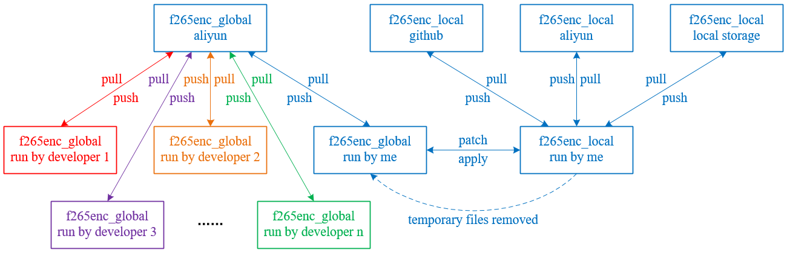

.. -----------------------------------------------------------------------------
    ..
    ..  Filename       : main.rst
    ..  Author         : Huang Leilei
    ..  Created        : 2020-07-18
    ..  Description    : version control related documents
    ..
.. -----------------------------------------------------------------------------

Version Control
===============

(20200917) Platform
-------------------

    |   We are running version control on https://code.aliyun.com/.
    |   Please sign up and send your username to me.

(20200917) Policy
-----------------

*   **Always exchange files through Git.**
*   **Always revert unnecessary changes.**
*   **Always make each commitment "atomic".**
*   **Always run script/runListUpdate.sh before each commitment.**
*   **Always use "rebase" rather than "merge".**

(20200917) Deployment
---------------------

(20200917) Flow
---------------

for junior developers
.....................

.. table::
    :align: left
    :widths: auto

    +---------------------------+-----------------------+-----------------+----------------------------------------------------------+
    | operation                 | graph                 | operation       | command                                                  |
    | of master                 |                       | of developer    | of developer                                             |
    +===========================+=======================+=================+==========================================================+
    | create a repo             | .. image:: flow00.png |                 |                                                          |
    |                           |                       |                 |                                                          |
    +---------------------------+-----------------------+-----------------+----------------------------------------------------------+
    | edit and commit           | .. image:: flow01.png |                 |                                                          |
    +---------------------------+-----------------------+-----------------+----------------------------------------------------------+
    | push                      | .. image:: flow02.png |                 |                                                          |
    +---------------------------+-----------------------+-----------------+----------------------------------------------------------+
    |                           | .. image:: flow03.png | clone           | git clone git@code.aliyun.com:llhuang/f265enc_global.git |
    +---------------------------+-----------------------+-----------------+----------------------------------------------------------+
    | | create a new branch,    | .. image:: flow04.png |                 |                                                          |
    | | for example, test       |                       |                 |                                                          |
    | | switch to test          |                       |                 |                                                          |
    | | edit and commit         |                       |                 |                                                          |
    +---------------------------+-----------------------+-----------------+----------------------------------------------------------+
    | push                      | .. image:: flow05.png |                 |                                                          |
    +---------------------------+-----------------------+-----------------+----------------------------------------------------------+
    |                           | .. image:: flow06.png | pull            | git checkout -b test_id origin/test                      |
    |                           |                       |                 |                                                          |
    +---------------------------+-----------------------+-----------------+----------------------------------------------------------+
    | | switch to master        | .. image:: flow07.png | edit and commit | | *edit*                                                 |
    | | edit and commit         |                       |                 | | git add                                                |
    |                           |                       |                 | | git commit                                             |
    |                           |                       |                 | | ...                                                    |
    |                           |                       |                 | | *edit*                                                 |
    |                           |                       |                 | | git add                                                |
    |                           |                       |                 | | git commit                                             |
    +---------------------------+-----------------------+-----------------+----------------------------------------------------------+
    |                           | .. image:: flow08.png | push            | git push origin test_id                                  |
    +---------------------------+-----------------------+-----------------+----------------------------------------------------------+
    | | switch to test          | .. image:: flow09.png |                 |                                                          |
    | | pull and rebase         |                       |                 |                                                          |
    +---------------------------+-----------------------+-----------------+----------------------------------------------------------+
    | edit and commit           | .. image:: flow10.png |                 |                                                          |
    +---------------------------+-----------------------+-----------------+----------------------------------------------------------+
    | push                      | .. image:: flow11.png |                 |                                                          |
    +---------------------------+-----------------------+-----------------+----------------------------------------------------------+
    |                           | .. image:: flow12.png | pull            | git reset --hard origin/test                             |
    +---------------------------+-----------------------+-----------------+----------------------------------------------------------+
    | | switch to master        | .. image:: flow13.png | edit and commit | | *edit*                                                 |
    | | edit and commit         |                       |                 | | git add                                                |
    |                           |                       |                 | | git commit                                             |
    |                           |                       |                 | | ...                                                    |
    |                           |                       |                 | | *edit*                                                 |
    |                           |                       |                 | | git add                                                |
    |                           |                       |                 | | git commit                                             |
    +---------------------------+-----------------------+-----------------+----------------------------------------------------------+
    |                           | .. image:: flow14.png | push            | git push -f origin test_id                               |
    +---------------------------+-----------------------+-----------------+----------------------------------------------------------+
    | | switch to test          | .. image:: flow15.png |                 |                                                          |
    | | pull and rebase         |                       |                 |                                                          |
    +---------------------------+-----------------------+-----------------+----------------------------------------------------------+
    | | edit and commit         | .. image:: flow16.png |                 |                                                          |
    | | "make a shortcut"       |                       |                 |                                                          |
    +---------------------------+-----------------------+-----------------+----------------------------------------------------------+
    | | switch to master        | .. image:: flow17.png |                 |                                                          |
    | | rebase                  |                       |                 |                                                          |
    +---------------------------+-----------------------+-----------------+----------------------------------------------------------+
    | push                      | .. image:: flow18.png |                 |                                                          |
    +---------------------------+-----------------------+-----------------+----------------------------------------------------------+
    |                           | .. image:: flow19.png | pull            | | git checkout master                                    |
    |                           |                       |                 | | git pull (--rebase)                                    |
    |                           |                       |                 | | git branch -D test_id                                  |
    +---------------------------+-----------------------+-----------------+----------------------------------------------------------+

for senior developers
.....................

.. table::
    :align: left
    :widths: auto

    +---------------------------+-----------------------------+------------------------+----------------------------------------------------------+
    | operation                 | graph                       | operation              | command                                                  |
    | of master                 |                             | of developer           | of developer                                             |
    +===========================+=============================+========================+==========================================================+
    | create a repo             | .. image:: flowSenior00.png |                        |                                                          |
    |                           |                             |                        |                                                          |
    +---------------------------+-----------------------------+------------------------+----------------------------------------------------------+
    | edit and commit           | .. image:: flowSenior01.png |                        |                                                          |
    +---------------------------+-----------------------------+------------------------+----------------------------------------------------------+
    | push                      | .. image:: flowSenior02.png |                        |                                                          |
    +---------------------------+-----------------------------+------------------------+----------------------------------------------------------+
    |                           | .. image:: flowSenior03.png | clone                  | git clone git@code.aliyun.com:llhuang/f265enc_global.git |
    +---------------------------+-----------------------------+------------------------+----------------------------------------------------------+
    | edit and commit           | .. image:: flowSenior04.png | | create a new branch, | | git checkout -b test                                   |
    |                           |                             | | for example, test    | | *edit*                                                 |
    |                           |                             | | switch to test       | | git add                                                |
    |                           |                             | | edit and commit      | | git commit                                             |
    |                           |                             |                        | | *edit*                                                 |
    |                           |                             |                        | | git add                                                |
    |                           |                             |                        | | git commit                                             |
    +---------------------------+-----------------------------+------------------------+----------------------------------------------------------+
    |                           | .. image:: flowSenior05.png | push                   | git push origin test                                     |
    +---------------------------+-----------------------------+------------------------+----------------------------------------------------------+
    | pull                      | .. image:: flowSenior06.png |                        |                                                          |
    |                           |                             |                        |                                                          |
    +---------------------------+-----------------------------+------------------------+----------------------------------------------------------+
    | | switch to test          | .. image:: flowSenior07.png | edit and commit        | | *edit*                                                 |
    | | edit and commit         |                             |                        | | git add                                                |
    |                           |                             |                        | | git commit                                             |
    |                           |                             |                        | | ...                                                    |
    |                           |                             |                        | | *edit*                                                 |
    |                           |                             |                        | | git add                                                |
    |                           |                             |                        | | git commit                                             |
    +---------------------------+-----------------------------+------------------------+----------------------------------------------------------+
    | push                      | .. image:: flowSenior08.png |                        |                                                          |
    +---------------------------+-----------------------------+------------------------+----------------------------------------------------------+
    |                           | .. image:: flowSenior09.png |                        | | git pull --rebase origin test                          |
    |                           |                             |                        | | (\ *fix conflicts*)                                    |
    |                           |                             |                        | | (git rebase \-\-continue)                              |
    +---------------------------+-----------------------------+------------------------+----------------------------------------------------------+
    | | switch to master        | .. image:: flowSenior10.png | edit and commit        | | *edit*                                                 |
    | | edit and commit         |                             |                        | | git add                                                |
    |                           |                             |                        | | git commit                                             |
    |                           |                             |                        | | ...                                                    |
    |                           |                             |                        | | *edit*                                                 |
    |                           |                             |                        | | git add                                                |
    |                           |                             |                        | | git commit                                             |
    +---------------------------+-----------------------------+------------------------+----------------------------------------------------------+
    |                           | .. image:: flowSenior11.png | push                   | git push origin test                                     |
    +---------------------------+-----------------------------+------------------------+----------------------------------------------------------+
    | pull                      | .. image:: flowSenior12.png |                        |                                                          |
    +---------------------------+-----------------------------+------------------------+----------------------------------------------------------+
    | | switch to test          | .. image:: flowSenior13.png | edit and commit        |                                                          |
    | | edit and commit         |                             |                        |                                                          |
    +---------------------------+-----------------------------+------------------------+----------------------------------------------------------+
    | | switch to master        | .. image:: flowSenior14.png |                        |                                                          |
    | | rebase                  |                             |                        |                                                          |
    +---------------------------+-----------------------------+------------------------+----------------------------------------------------------+
    | push                      | .. image:: flowSenior15.png |                        |                                                          |
    |                           |                             |                        |                                                          |
    +---------------------------+-----------------------------+------------------------+----------------------------------------------------------+
    |                           | .. image:: flowSenior16.png | pull                   | | git pull (--rebase) origin test                        |
    |                           |                             |                        | | git checkout master                                    |
    |                           |                             |                        | | git pull (--rebase)                                    |
    +---------------------------+-----------------------------+------------------------+----------------------------------------------------------+
